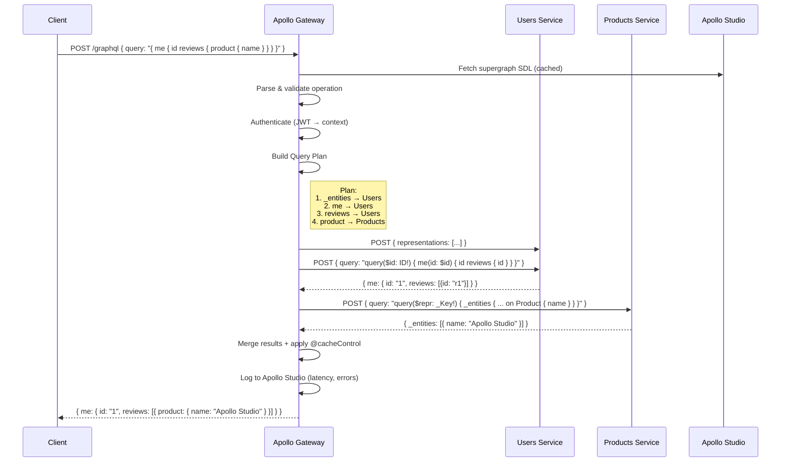

# Apollo GraphQL API Gateway

An **API Gateway** is a reverse-proxy server that serves as the single entry point for client applications interacting with a distributed system of microservices or backend APIs. When implemented with **Apollo GraphQL API Gateway** (part of the Apollo Federation ecosystem), it becomes a **GraphQL-first, schema-stitched, supergraph-aware gateway** that unifies multiple GraphQL and REST services into a single, performant, and developer-friendly GraphQL endpoint.

## Table of Contents
- [Apollo GraphQL API Gateway](#apollo-graphql-api-gateway)
  - [Table of Contents](#table-of-contents)
  - [What does **Apollo GraphQL API Gateway** do? (Updated for 2025)](#what-does-apollo-graphql-api-gateway-do-updated-for-2025)
  - [Why do we need **Apollo GraphQL API Gateway** in 2025?](#why-do-we-need-apollo-graphql-api-gateway-in-2025)
  - [Typical Flow: Client → Apollo Gateway → Subgraphs (Step-by-Step)](#typical-flow-client--apollo-gateway--subgraphs-step-by-step)
    - [Step-by-Step Breakdown:](#step-by-step-breakdown)
  - [Key 2025 Features in Apollo Gateway](#key-2025-features-in-apollo-gateway)
  - [Example: `gateway.js` (Apollo Server + Gateway)](#example-gatewayjs-apollo-server--gateway)
  - [Summary: Apollo GraphQL API Gateway in 2025](#summary-apollo-graphql-api-gateway-in-2025)

---

## What does **Apollo GraphQL API Gateway** do? (Updated for 2025)

Apollo Gateway is a **production-ready GraphQL API Gateway** that:

1. **Federates Multiple Subgraphs**  
   Combines independently deployed GraphQL services (subgraphs) into a **unified supergraph** using **Apollo Federation v2+** (with `@link`, `@inaccessible`, `@override`, and `@shareable` directives).

2. **Intelligent Query Planning & Execution**  
   - Parses incoming GraphQL operations  
   - Generates optimal **query plans** across subgraphs  
   - Executes parallel fetches with batched resolvers  
   - Merges results into a single coherent response

3. **Automatic Schema Composition & Validation**  
   - Validates subgraph compatibility at startup  
   - Enforces schema contracts  
   - Supports **schema versioning** and **deprecation policies**

4. **Advanced Routing & Service Discovery**  
   - Routes field resolutions to correct subgraphs using `@key`, `@requires`, and `@provides`  
   - Integrates with service registries (Kubernetes, Consul, etc.)

5. **Protocol Translation (GraphQL ↔ REST/gRPC)**  
   - Exposes REST/JSON endpoints as GraphQL types via **subgraph bridges**  
   - Converts legacy APIs into federated subgraphs

6. **Authentication & Authorization Passthrough**  
   - Validates JWTs, API keys, or OAuth tokens  
   - Injects headers/context into subgraph requests  
   - Supports **fine-grained access control** via `@auth` directives

7. **Caching & Performance Optimization**  
   - **Automatic Persisted Queries (APQ)**  
   - **Entity caching** (`@cacheControl`)  
   - **Response caching** with CDN integration  
   - **Full-query caching** via Redis or in-memory stores

8. **Request/Response Transformation**  
   - **Operation whitelisting/blacklisting**  
   - **Field-level redaction** (`@inaccessible`)  
   - **Custom middleware** (via plugins or Rover CLI extensions)

9. **Observability & Operations**  
   - **Apollo Studio integration** for:
     - Real-time schema registry
     - Usage analytics
     - Performance tracing (field-level latency)
     - Error tracking
   - OpenTelemetry export support

10. **Resilience & Fault Tolerance**  
    - **Circuit breaking** per subgraph  
    - **Retry policies** with exponential backoff  
    - **Timeouts & deadlines** propagation  
    - **Fallback responses** via custom logic

11. **Rate Limiting & Billing**  
    - Per-client, per-operation, or per-field throttling  
    - Usage-based billing via **Apollo Usage Reporting**

---

## Why do we need **Apollo GraphQL API Gateway** in 2025?

| Benefit | Explanation |
|-------|-------------|
| **Frontend Simplicity** | One GraphQL endpoint → no backend-for-frontend (BFF) sprawl |
| **Backend Decoupling** | Teams own subgraphs independently |
| **Performance** | Query planner minimizes over-fetching; parallel execution |
| **Security Centralization** | Auth, rate limiting, and PII redaction in one place |
| **Evolutionary Architecture** | Gradually migrate monoliths → microservices via federation |
| **Observability** | End-to-end tracing from client → subgraph field |

---

## Typical Flow: Client → Apollo Gateway → Subgraphs (Step-by-Step)



### Step-by-Step Breakdown:

| Step | Action |
|------|--------|
| 1 | Client sends GraphQL query to `/graphql` |
| 2 | Gateway loads **supergraph schema** from Apollo Studio or local Rover composition |
| 3 | Validates operation against schema + operation safelist |
| 4 | **Authenticates** request (e.g., JWT → `context.user`) |
| 5 | **Query Planner** analyzes query and generates execution plan |
| 6 | Executes plan in parallel across subgraphs |
| 7 | Subgraphs resolve fields; Gateway merges results using entity keys |
| 8 | Applies **response transformations** (e.g., format, redact) |
| 9 | **Caches** response (APQ, entity, full-query) |
| 10 | Logs metrics to **Apollo Studio** |
| 11 | Returns final JSON response to client |

---

## Key 2025 Features in Apollo Gateway

| Feature | Description |
|-------|-----------|
| **Supergraph Router** | High-performance Rust-based gateway (replaces Node.js managed gateway) |
| **Rover CLI v2** | Schema linting, contract testing, CI/CD checks |
| **GraphOS Platform** | SaaS control plane for schema governance |
| **Federation 3 (Preview)** | `@defer`, `@stream`, and incremental delivery |
| **Zero-Trust Security** | mTLS between gateway ↔ subgraphs |

---

## Example: `gateway.js` (Apollo Server + Gateway)

```js
import { ApolloServer } from '@apollo/server';
import { expressMiddleware } from '@apollo/server/express4';
import { ApolloGateway, IntrospectAndCompose } from '@apollo/gateway';
import express from 'express';

const gateway = new ApolloGateway({
  supergraphSdl: new IntrospectAndCompose({
    subgraphs: [
      { name: 'users', url: 'http://localhost:4001/graphql' },
      { name: 'products', url: 'http://localhost:4002/graphql' },
      { name: 'reviews', url: 'http://localhost:4003/graphql' },
    ],
  }),
  // Optional: Custom plugins
  plugins: [
    // Rate limiting, logging, etc.
  ],
});

const server = new ApolloServer({
  gateway,
  introspection: true,
  persistedQueries: { ttl: 900 }, // APQ
});

await server.start();

const app = express();
app.use('/graphql', expressMiddleware(server, {
  context: ({ req }) => ({
    auth: req.headers.authorization,
  }),
}));

app.listen(4000, () => {
  console.log('🚀 Apollo Gateway running at http://localhost:4000/graphql');
});
```

---

## Summary: Apollo GraphQL API Gateway in 2025

> **Apollo Gateway is not just an API Gateway — it’s a GraphOS-powered supergraph router that turns fragmented microservices into a seamless, secure, observable, and high-performance developer experience.**

It handles **routing, security, caching, resilience, and observability** — all while enabling **independent team ownership** and **incremental modernization**.

Use it when you want:
- One GraphQL API for all clients
- Zero backend-for-frontend
- Full visibility into performance
- Safe, governed schema evolution

---

**Official Resources (2025)**:
- [Apollo GraphOS Docs](https://www.apollographql.com/docs/graphos)
- [Supergraph Router (Rust)](https://www.apollographql.com/docs/router)
- [Rover CLI](https://www.apollographql.com/docs/rover)