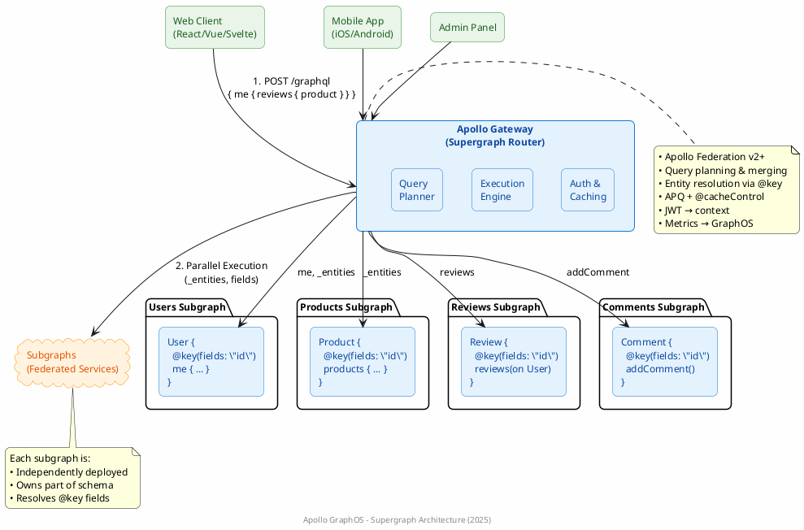
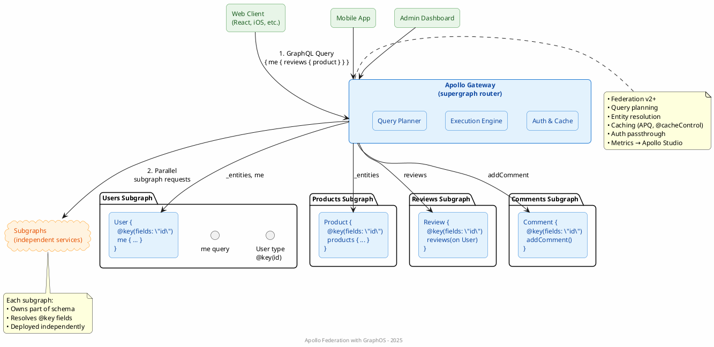

# Apollo GraphQL Gateway + Subgraphs

Here's your **updated PlantUML diagram** using **only Apollo GraphQL Gateway and Subgraphs** — **no AWS services, no API Gateway (REST), no Lambda, no DynamoDB**.

This reflects a **modern GraphQL Federation architecture** using **Apollo Gateway** and **federated subgraphs**.

---

### Updated PlantUML (Apollo GraphQL Gateway + Subgraphs)




## Fixed



---

### Key Features Shown

| Element | Meaning |
|-------|--------|
| **Apollo Gateway** | Single GraphQL endpoint; composes supergraph |
| **Query Planner** | Builds optimal execution plan across subgraphs |
| **Subgraphs** | Independent services contributing to the schema |
| **@key** | Enables entity stitching across services |
| **Parallel Requests** | Gateway fetches from multiple subgraphs concurrently |

---

### How to Render

1. Copy the code above
2. Paste into any PlantUML renderer:
   - [https://www.plantuml.com/plantuml](https://www.plantuml.com/plantuml)
   - VS Code + PlantUML extension
   - IntelliJ, Confluence, etc.

---

### Example Query This Architecture Supports

```graphql
query {
  me {
    id
    name
    reviews {
      body
      product {
        name
        price
      }
    }
  }
}
```

→ Resolved across **Users**, **Reviews**, and **Products** subgraphs via **Apollo Gateway**.

---

Let me know if you want:
- A **horizontal layout**
- **Kubernetes deployment view**
- **With Apollo Studio / GraphOS**
- **Rust-based Router** emphasis
- **Persisted Queries / APQ** flow