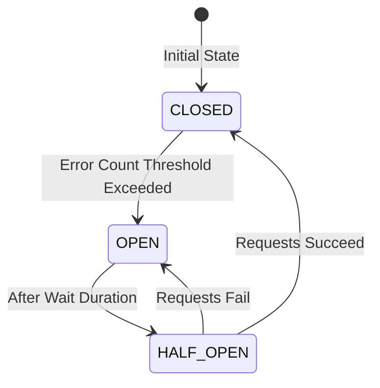

# Circuit Breaker pattern

## What it is and when to use it

The Circuit Breaker pattern is a design pattern used in software development to improve the resilience and fault tolerance of a system. It is inspired by the electrical circuit breaker, which is designed to protect electrical circuits from damage caused by excess current.

In software development, the Circuit Breaker pattern is used to detect and handle errors that occur when calling external services or accessing remote resources. The pattern is designed to prevent cascading failures by providing an alternative path for the application to take when a service or resource is unavailable.

The Circuit Breaker pattern is implemented as a wrapper around a potentially failing operation. When the operation is called, the Circuit Breaker checks if the operation is currently failing. If the failure rate is below a certain threshold, the operation is allowed to proceed. However, if the failure rate is above the threshold, the Circuit Breaker opens and redirects the call to a fallback mechanism, such as a cached response or a different service.

The Circuit Breaker pattern is useful in situations where external services or resources are unreliable or unpredictable, such as when calling a third-party API or accessing a remote database. By implementing a Circuit Breaker, you can prevent your application from becoming overloaded with requests that may fail, and instead provide a more robust and reliable experience for your users.

To summarize, the Circuit Breaker pattern is used to:

- Detect and handle errors that occur when calling external services or accessing remote resources
- Prevent cascading failures by providing an alternative path for the application to take when a service or resource is unavailable
- Improve the resilience and fault tolerance of a system

It is recommended to use the Circuit Breaker pattern when designing systems that interact with external services or resources, especially when those services or resources are unreliable or unpredictable.

## How is the monitoring with circuit breaker?

Monitoring is a critical aspect of the Circuit Breaker pattern, as it allows you to detect and respond to failures in a timely manner. There are a few ways in which monitoring can be implemented with Circuit Breakers:

1. Error thresholds: The Circuit Breaker can be configured with error thresholds that determine when the Circuit Breaker should open. For example, you can set a threshold of 50% errors over a given period. If the error rate exceeds this threshold, the Circuit Breaker will open and redirect calls to the fallback mechanism.

2. Metrics: The Circuit Breaker can also be instrumented with metrics that track the success and failure rates of the operations being called. This can be done using a monitoring tool like Prometheus or Grafana. By monitoring these metrics, you can identify trends and patterns in the error rates and adjust the error thresholds accordingly.

3. Health checks: The Circuit Breaker can periodically perform health checks on the external services or resources being called. This can be done using a tool like Consul or Kubernetes. If the health check fails, the Circuit Breaker will open and redirect calls to the fallback mechanism.

4. Logging: The Circuit Breaker can log errors and events that occur during the operation. This can be useful for debugging and troubleshooting issues that occur with the external services or resources.

Overall, monitoring is a critical aspect of the Circuit Breaker pattern, as it allows you to detect and respond to failures in a timely manner. By monitoring error rates, metrics, health checks, and logging, you can ensure that your system is resilient and reliable even when interacting with unpredictable external services or resources.

## How about the states?

The Circuit Breaker pattern has three main states: Closed, Open, and Half-Open.

1. Closed: In the Closed state, the Circuit Breaker allows requests to pass through to the external service. This means that the external service is healthy and responding correctly to requests.

2. Open: In the Open state, the Circuit Breaker prevents requests from passing through to the external service. This means that the external service is not responding correctly to requests, and the Circuit Breaker has detected a failure. Instead of allowing requests to continue to fail, the Circuit Breaker opens and redirects them to a fallback mechanism.

3. Half-Open: In the Half-Open state, the Circuit Breaker allows a limited number of requests to pass through to the external service to test its health. If the requests succeed, the Circuit Breaker moves back to the Closed state, allowing requests to pass through normally. If the requests fail, the Circuit Breaker moves back to the Open state, preventing requests from passing through.

The state of the Circuit Breaker is determined by a combination of the error rate and the error threshold. If the error rate exceeds the error threshold, the Circuit Breaker opens and enters the Open state. If the error rate is below the error threshold, the Circuit Breaker closes and enters the Closed state.

The Half-Open state is used to test the health of the external service and determine if it has recovered. By allowing a limited number of requests to pass through, the Circuit Breaker can quickly determine if the external service is healthy and ready to receive requests again.

Overall, the three states of the Circuit Breaker pattern are used to control the flow of requests to external services, detect failures, and ensure that the system remains resilient and reliable.

## Projects that support breaker with java and spring

There are several projects in the Java and Spring ecosystems that support the Circuit Breaker pattern, including:

1. Netflix Hystrix: Hystrix is a fault tolerance library developed by Netflix that implements the Circuit Breaker pattern. It provides a simple and powerful API for implementing Circuit Breakers in your Java applications, as well as features like fallbacks, metrics, and monitoring.

2. Resilience4j: Resilience4j is a lightweight fault tolerance library for Java 8+ and Kotlin. It provides several resilience patterns, including the Circuit Breaker pattern, and is designed to be easy to use and highly configurable. It also integrates well with popular frameworks like Spring Boot.

3. Spring Cloud Circuit Breaker: Spring Cloud Circuit Breaker is a Spring Boot project that provides an abstraction layer for implementing Circuit Breakers in your applications. It supports multiple Circuit Breaker implementations, including Hystrix and Resilience4j, and provides a consistent API for working with Circuit Breakers.

4. Spring Retry: Spring Retry is a Spring Boot project that provides a simple and flexible API for retrying failed operations. It can be used in conjunction with Circuit Breakers to provide additional resilience and fault tolerance in your applications.

These projects make it easy to implement Circuit Breakers in your Java and Spring applications, and provide features like fallbacks, metrics, and monitoring to help you detect and respond to failures. They are widely used in production environments and have been battle-tested by large companies like Netflix and Alibaba.

## how does a proxy for a circuit breaker work?

A proxy for a Circuit Breaker works by intercepting requests to an external service and applying the Circuit Breaker pattern to them. The proxy acts as a middleware between your application and the external service, and provides additional fault tolerance and resilience.

When a request is made to the external service, the proxy first checks the state of the Circuit Breaker. If the Circuit Breaker is closed, the request is passed through to the external service. If the Circuit Breaker is open, the proxy immediately returns a response from the fallback mechanism, without making the request to the external service.

If the Circuit Breaker is in the Half-Open state, the proxy allows a limited number of requests to pass through to the external service to test its health. If the requests succeed, the Circuit Breaker moves back to the Closed state, allowing requests to pass through normally. If the requests fail, the Circuit Breaker moves back to the Open state, preventing requests from passing through.

The proxy also provides additional features like fallbacks, timeouts, and retries. If the request to the external service times out or fails, the proxy can return a response from a fallback mechanism, or retry the request a certain number of times before giving up.

In a microservices architecture, the proxy is typically implemented as a separate service that sits between your application and the external services. It can be implemented using a variety of technologies, including NGINX, Envoy, and Istio.

Overall, the proxy for a Circuit Breaker provides an additional layer of fault tolerance and resilience to your applications, ensuring that they remain robust and reliable even in the face of failures and errors from external services.

## What are the tradeoffs of a proxy for a circuit breaker?

While a proxy for a Circuit Breaker provides many benefits, it also has some tradeoffs that should be considered:

1. Additional complexity: Implementing a proxy for a Circuit Breaker adds additional complexity to your application architecture. You need to configure, deploy, and manage the proxy, which can increase the overall complexity of your system.

2. Increased latency: Since requests to the external service need to be intercepted and processed by the proxy, there can be some additional latency introduced. This can affect the overall performance of your application.

3. Single point of failure: If the proxy fails, your entire system can be affected. This can be mitigated by deploying multiple instances of the proxy and using load balancing, but it still presents a risk that should be considered.

4. Increased resource usage: The proxy needs to handle and process all requests to the external service, which can increase resource usage and put additional load on your servers.

5. Cost: Implementing a proxy for a Circuit Breaker may require additional resources and infrastructure, which can increase the cost of your system.

Despite these tradeoffs, a proxy for a Circuit Breaker can provide significant benefits in terms of fault tolerance and resilience. By intercepting requests to external services and applying the Circuit Breaker pattern, you can ensure that your applications remain robust and reliable, even in the face of failures and errors from external services.

## Technologies that can be used to implement a proxy for a Circuit Breaker

In a microservices architecture, there are several technologies that can be used to implement a proxy for a Circuit Breaker, including NGINX, Envoy, and Istio.

1. NGINX: NGINX is a lightweight, high-performance web server and reverse proxy that is commonly used in microservices architectures. It can be used to implement a Circuit Breaker by intercepting requests to external services and applying the Circuit Breaker pattern. NGINX provides several features that are useful in microservices architectures, including load balancing, SSL termination, and caching.

2. Envoy: Envoy is a modern, high-performance proxy and service mesh that is specifically designed for microservices architectures. It provides powerful features for traffic management, observability, and security, and can be used to implement a Circuit Breaker by intercepting requests to external services and applying the Circuit Breaker pattern. Envoy is widely used in production environments and is a popular choice for implementing service meshes.

3. Istio: Istio is a service mesh that provides powerful features for traffic management, security, and observability in microservices architectures. It includes a built-in Circuit Breaker implementation that can be used to provide fault tolerance and resilience for external services. Istio also provides other features like mutual TLS, traffic routing, and telemetry, which make it a powerful tool for managing and securing microservices.

These technologies provide powerful features for implementing a proxy for a Circuit Breaker in a microservices architecture. They are widely used in production environments and have been battle-tested by large companies like Google and Lyft. However, they also add additional complexity to your system and require additional resources and infrastructure to deploy and manage. It's important to carefully evaluate the tradeoffs and choose the technology that best fits the needs of your system.

## The circuit breaker has three states

Closed:
In this state, the circuit breaker allows normal service communication, and requests go through to the service.
Circuit breaker monitors the responses from the service for errors. If the responses are successful with no issues, it remains in the closed state.

Open:
When the number of failures reaches a threshold, the circuit breaker switches to the open state, preventing requests from reaching the service and providing a fallback response.
(Threshold Value like 5 failures within 10 seconds)

Half-Open:
Once the timeout or reset interval passes, the circuit breaker goes to the “Half-Open” state.
It allows a limited number of test requests to pass through to the service to see if the service has recovered or not.
If the test requests succeed, it means the service has recovered and the circuit breaker goes back to “Closed” state.
If any of the test requests fails, it means the service has still issues and the circuit breaker goes to “Open” state to block further requests.

## There are several tools and frameworks implementing the circuit breaker pattern. Here are some popular options:
1. Netflix Hystrix:
2. Resilience4j:
3. Istio:
4. Sentinel:
5. Amazon App Mesh:
6. 
## Videos

 * [Circuit Breaker: Não trabalhe com microsserviços sem saber disso](https://www.youtube.com/watch?v=hxRn8y5KTzQ)
	> 

 * [Spring Boot 3 | Circuit Breakers using Resilience4J | Microservices Resiliency Primer](https://www.youtube.com/watch?v=3-ChrD3Zosg)
	> 

 * [Circuit Breaker: What it is and when to use it](https://www.youtube.com/watch?v=__sF8kjULtM)
	> 

## References

1. https://spring.io/projects/spring-cloud-circuitbreaker
2. https://www.baeldung.com/spring-boot-resilience4j
3. https://reflectoring.io/circuitbreaker-with-resilience4j/
4. https://medium.com/@minadev/circuit-breaker-pattern-in-microservices-9568320f2059#:~:text=Circuit%20Breaker%20is%20a%20design,tolerance%20of%20a%20distributed%20system.
