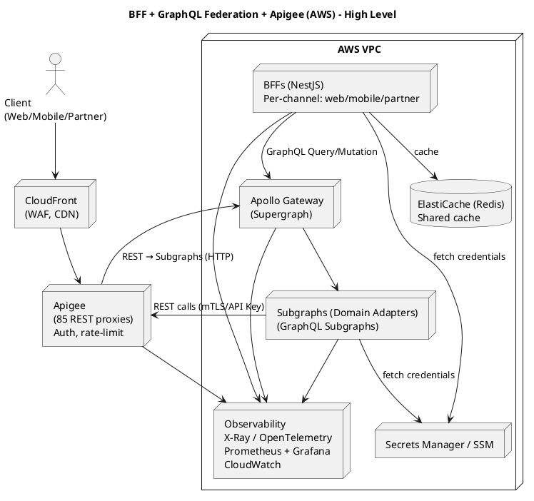

# BFF + GraphQL Federation + Apigee + AWS in a blueprint architecture

A production-ready blueprint you can hand to architects and SREs. It assumes:

* You must keep **Apigee** as the API edge (85 REST proxies).
* You want a **GraphQL federation layer** that wraps those REST proxies (subgraphs/adapters).
* You want **BFF(s)** (NestJS) per channel that handle auth/UX and *execute GraphQL queries under the hood* against the supergraph.
* Platform: **AWS** (scalable, observable, secure).

I’ll deliver: component diagram (text + PlantUML), end-to-end data flows, scalability & resilience patterns, security model, recommended tech stack, infra/CI/CD notes, and a concrete folder layout with key code patterns (token exchange, DataLoader, caching, circuit breakers).

---

## Table of Contents

- [BFF + GraphQL Federation + Apigee + AWS in a blueprint architecture](#bff--graphql-federation--apigee--aws-in-a-blueprint-architecture)
  - [Table of Contents](#table-of-contents)
  - [1. High-level component diagram (text + PlantUML)](#1-high-level-component-diagram-text--plantuml)
  - [2. Key architecture responsibilities (explicit boundaries)](#2-key-architecture-responsibilities-explicit-boundaries)
  - [3. End-to-end data flows (numbered)](#3-end-to-end-data-flows-numbered)
  - [4. Scalability \& resilience patterns](#4-scalability--resilience-patterns)
  - [5. Security model (production-ready)](#5-security-model-production-ready)
  - [6. Observability \& SLOs](#6-observability--slos)
  - [7. Recommended tech stack (concrete)](#7-recommended-tech-stack-concrete)
  - [8. Folder layout (monorepo suggestion)](#8-folder-layout-monorepo-suggestion)
  - [9. Concrete code \& config patterns (short snippets)](#9-concrete-code--config-patterns-short-snippets)
    - [A — BFF calls supergraph (NestJS example using `graphql-request`)](#a--bff-calls-supergraph-nestjs-example-using-graphql-request)
    - [B — Token exchange (pseudo)](#b--token-exchange-pseudo)
    - [C — DataLoader in subgraph to batch Apigee calls](#c--dataloader-in-subgraph-to-batch-apigee-calls)
    - [D — Circuit breaker wrapper (opossum example)](#d--circuit-breaker-wrapper-opossum-example)
  - [10. CI/CD, Testing \& Schema governance](#10-cicd-testing--schema-governance)
  - [11. Operational runbook (short)](#11-operational-runbook-short)
  - [12. Tradeoffs \& migration notes](#12-tradeoffs--migration-notes)
  - [13. Quick checklist to get started (first 90 days)](#13-quick-checklist-to-get-started-first-90-days)
  - [Final notes](#final-notes)
  - [References](#references)

---

## 1. High-level component diagram (text + PlantUML)

Textual overview (top → bottom):

* Client (Web, Mobile, Partner)
  → CloudFront (static CDN, edge caching, WAF)
  → Apigee (edge REST gateway, OAuth2, rate limits, quotas)
  → GraphQL Federation Layer (subgraphs that wrap Apigee REST or direct microservices)

  * Each *subgraph* is a domain adapter that calls one or more Apigee proxies (or microservices)
  * Apollo Gateway / Supergraph composes subgraphs into single GraphQL endpoint
    → BFF(s) (NestJS per channel)
  * BFF calls Supergraph using GraphQL (query/mutation), performs UX shaping, token exchange, caching, orchestrates UI workflows when needed
    → Clients receive UI-ready responses

Observability, tracing, secrets store, Redis cache, and CI/CD are cross-cutting.

PlantUML (paste into any PlantUML viewer):



---

## 2. Key architecture responsibilities (explicit boundaries)

* **CloudFront + Apigee (Edge & API Platform)**

  * *Responsibilities*: ingress, OAuth2 token issuance/validation, global rate limits, quotas, request/response logging, TLS termination, WAF.
  * *NOT*: UI shaping, heavy aggregation, business workflows.

* **Subgraphs (GraphQL adapters)**

  * *Responsibilities*: domain schema ownership, mapping domain model → GraphQL types/resolvers, calling Apigee proxies (or microservices) to fetch domain data, keeping domain logic, caching domain-level queries when sensible.
  * *NOT*: UI-specific formatting or session-specific auth.

* **Apollo Gateway / Supergraph**

  * *Responsibilities*: schema composition, query planning, federated execution, cross-domain resolution, query-level metrics.
  * *NOT*: client-side presentation logic.

* **BFF (NestJS, per channel)**

  * *Responsibilities*: auth/session handling and token exchange, coarse orchestration for UI workflows, UX shaping (payload format, device-specific pagination, image resizing decisions), feature flags, per-client caching, A/B handling, access control enforcement at the UI level.
  * *NOT*: core domain business logic, long-running processes.

* **Platform services**

  * Secrets Manager, ELB/ALB, EKS/ECS, ElastiCache Redis, X-Ray/OTEL, CloudWatch, CI/CD (CodePipeline/GitHub Actions), Terraform/CloudFormation.

---

## 3. End-to-end data flows (numbered)

Flow A — Page load (read-heavy):

1. Client (Web) requests `/app` → CloudFront (edge) serves static assets.
2. Client issues `GET /api/dashboard` to BFF (API endpoint).
3. BFF checks session/JWT; if short-lived token, BFF calls IdP for token exchange (OAuth 2.0 Token Exchange) or uses refresh token flow.
4. BFF constructs GraphQL queries and calls **Apollo Gateway** (supergraph endpoint) with Authorization header.
5. Apollo Gateway composes query and routes parts to appropriate Subgraphs.
6. Subgraphs call Apigee REST proxies (mTLS/API Key) to fetch data from underlying services.
7. Responses return up through Gateway → BFF. Gateway and subgraphs add tracing metadata.
8. BFF performs UX shaping (merge fields, compute derived flags, trim arrays), caches UI-level responses in Redis (if appropriate), and returns JSON to client.
9. Observability: spans go to X-Ray/OTel; metrics to Prometheus/Grafana and CloudWatch.

Flow B — Mutation / checkout (workflow):

1. Client posts `POST /api/checkout` to BFF.
2. BFF validates payload, performs idempotency check, and starts a workflow:
   a. Calls Gateway GraphQL mutation to create order (subgraph orchestrates domain-level calls via Apigee).
   b. After domain reply, BFF calls payment service (via GraphQL or directly to Apigee) and awaits result.
   c. BFF may perform compensating actions on failures (or instruct orchestrator).
3. BFF returns UI-friendly status to client and emits events to event bus (SNS/SQS/Kafka) for async processing.

Flow C — Subgraph schema evolution:

* A team updates its subgraph schema. CI runs schema checks + contract tests. Supergraph is validated in staging before production. Rolling deploy + schema compatibility checks prevent breaking changes.

---

## 4. Scalability & resilience patterns

**Compute & deployment**

* Use **EKS (Fargate)** or **ECS Fargate** for subgraphs, Gateway, and BFFs (stateless). Benefits: pod autoscaling, managed infra.
* Use **Horizontal Pod Autoscaler (HPA)** based on CPU / memory / request latency. Configure **PodDisruptionBudgets** and readiness probes.

**API surface / caching**

* CloudFront for static assets and edge caching of GraphQL GET responses when safe.
* **Response caching** at Apollo Gateway for read-only queries (cache-control).
* **Redis (ElastiCache)** for shared caching: supergraph query results, DataLoader cache shards, session cache.
* **Client-side caching** using persisted queries where appropriate.

**Load protection**

* Apigee handles the first-level rate limiting. Add per-client rate limiting at BFF and Gateway (token bucket).
* Use WAF (AWS WAF) for edge rules, bot management, and OWASP protections.

**Bottleneck handling**

* Use **DataLoader** in subgraphs or gateway to batch identical backend calls and reduce N+1.
* Implement **circuit breakers** and **bulkheads** per downstream Apigee proxy (e.g., opossum or resilience patterns).
* Retries with exponential backoff and jitter. Limit retry count for idempotent operations only.

**Query cost control**

* Use persisted queries and query complexity analysis at the Gateway to prevent expensive client queries. Set max depth and cost. Use persisted queries for mobile clients to ensure predictable cost.

**Async & eventual consistency**

* Use SNS/SQS/EventBridge/Kafka for async flows to decouple user response latency from long domain processes.

**Deployment strategy**

* Use **canary/blue-green** deployments (App Mesh or ALB weighted routing). Apollo Gateway supports runtime configuration; roll subgraphs and gateway with gradual rollout.

---

## 5. Security model (production-ready)

**Identity & auth**

* Central IdP (Auth0/Cognito/Keycloak/Okta). Apigee enforces OAuth2 at ingress.
* BFF performs **token exchange** (OAuth 2.0 Token Exchange) to get backend credentials if needed. Store client secrets in **AWS Secrets Manager**.
* Use short-lived tokens between BFF / Gateway and subgraphs. Prefer mTLS + service identity for service-to-service.

**Network**

* Place subgraphs and Gateway in private subnets. Use **API Gateway Private** or internal ALB for internal services. Use **AWS PrivateLink** for sensitive external integrations.
* Use Security Groups with least privilege and network ACLs.

**Transport & API keys**

* All calls to Apigee sub-proxies use mTLS or API keys configured in Secrets Manager. Rotate keys regularly.

**Data protection**

* Encrypt at rest (S3, RDS, Redis) and in transit (TLS1.2+).
* Use IAM least privilege for service roles.

**Runtime protections**

* WAF for OWASP rules.
* Rate limits and throttling across layers (Apigee primary, Gateway/BFF secondary).

---

## 6. Observability & SLOs

**Tracing**

* Use **OpenTelemetry** instrumented in BFF, Gateway, subgraphs. Export to **AWS X-Ray** (or vendor like Datadog). Correlate traces across Apigee traces/logs.

**Metrics**

* Prometheus for app metrics; Grafana dashboards. CloudWatch as backup for AWS infra metrics. Track latency, error rate, throughput, cache hit ratio, QPS per subgraph.

**Logging**

* Structured JSON logs to CloudWatch Logs (or Elasticsearch). Centralized correlation ids (trace id, request id).

**SLOs**

* Define SLOs per endpoint (P95 latency < X ms, Error rate < Y%). Use alerting (PagerDuty).

---

## 7. Recommended tech stack (concrete)

Frontend / BFF / Federation:

* BFF: **NestJS** (TypeScript) — modular, middleware, GraphQL client support.
* GraphQL Gateway: **Apollo Gateway** (or Apollo Router for performance) — Supergraph composition.
* Subgraphs: NodeJS (Apollo Server + small adapter) or any language (Java/Spring Boot GraphQL) depending on team. Use **RESTDataSource** or custom fetchers to call Apigee.

AWS platform:

* Compute: **EKS (Fargate)** or **ECS Fargate** for services.
* Load balancing: **ALB** for internal services, **CloudFront** at the edge.
* Secrets: **AWS Secrets Manager / SSM Parameter Store**.
* Cache: **ElastiCache (Redis)**.
* Observability: **OpenTelemetry + AWS X-Ray**, **Prometheus + Grafana**, **CloudWatch**.
* Messaging: **SQS / SNS / EventBridge** for async workflows.
* CI/CD: **GitHub Actions** or **AWS CodePipeline** with Terraform for infra.
* Storage: **S3** for artifacts and persisted query store.

Reliability & infra:

* Service mesh (optional): **AWS App Mesh** if you want fine-grained traffic control/observability.
* API Platform: **Apigee** (existing).
* DBs: **Aurora (Postgres)** or **RDS** for any BFF persistent needs.

Security:

* IdP: **AWS Cognito** (if simple) or **Keycloak / Okta / Auth0**.
* mTLS: use certs managed with AWS Certificate Manager (ACM) and Secrets Manager.

---

## 8. Folder layout (monorepo suggestion)

Monorepo (Nx or plain yarn workspaces):

```
/repo
  /apps
    /bff-web              # NestJS BFF for web
    /bff-mobile           # NestJS BFF for mobile (if needed)
    /gateway              # Apollo Gateway / Router + runtime
  /packages
    /subgraphs
      /user-subgraph
      /orders-subgraph
      /billing-subgraph
      ...                 # one per domain
    /libs
      /common             # shared types, utils (GraphQL types, error handling)
      /auth               # token exchange helpers
      /observability      # OTEL helpers, logging
      /http-client        # fetch wrappers with circuit-breaker
  /infra
    /terraform           # EKS, ALB, Redis, IAM, Secrets, CloudFront
    /k8s                 # k8s manifests, helm charts
  /ci
    /github-actions      # CI workflow templates
  README.md
```

Key points:

* Keep subgraphs as separate deployable units owned by domain teams.
* BFFs are separate per channel to avoid conflicts and to allow independent scaling/deploy.
* `libs/common` contains GraphQL shared type definitions or codegen results.

---

## 9. Concrete code & config patterns (short snippets)

### A — BFF calls supergraph (NestJS example using `graphql-request`)

```ts
// bff/src/graphql-client.ts
import { GraphQLClient } from 'graphql-request';
import { Injectable } from '@nestjs/common';

@Injectable()
export class GqlClient {
  private client: GraphQLClient;
  constructor() {
    this.client = new GraphQLClient(process.env.SUPERGRAPH_URL);
  }

  async query<T>(query: string, variables?: any, token?: string) {
    const headers = token ? { Authorization: `Bearer ${token}` } : {};
    return this.client.request<T>(query, variables, headers);
  }
}
```

### B — Token exchange (pseudo)

```ts
// bff/src/auth/token-exchange.ts
import axios from 'axios';
export async function exchangeUserToken(userJwt: string) {
  // OAuth 2.0 token exchange to get a service token for calling backend
  const resp = await axios.post(process.env.IDP_TOKEN_EXCHANGE_URL, {
    grant_type: 'urn:ietf:params:oauth:grant-type:token-exchange',
    subject_token: userJwt,
    subject_token_type: 'urn:ietf:params:oauth:token-type:jwt',
    client_id: process.env.BFF_CLIENT_ID,
    client_secret: process.env.BFF_CLIENT_SECRET,
    audience: 'supergraph'
  });
  return resp.data.access_token;
}
```

### C — DataLoader in subgraph to batch Apigee calls

```ts
// subgraph/src/loaders/orderLoader.ts
import DataLoader from 'dataloader';
import axios from 'axios';

export const orderLoader = new DataLoader(async (userIds: string[]) => {
  const results = await Promise.all(userIds.map(id => axios.get(`${APIGEE_ORDERS}/by-user/${id}`)));
  return results.map(r => r.data);
});
```

### D — Circuit breaker wrapper (opossum example)

```ts
const CircuitBreaker = require('opossum');
function wrappedFetch(url, opts) {
  const breaker = new CircuitBreaker(() => fetch(url, opts), { timeout: 2000, errorThresholdPercentage: 50 });
  return breaker.fire();
}
```

---

## 10. CI/CD, Testing & Schema governance

* **CI**: unit tests → lint → build subgraph image → publish to registry.
* **Contract tests**: each subgraph must include contract tests that validate responses from Apigee proxies (or mocked Apigee).
* **Schema checks**: Use Apollo’s schema registry or `rover` to validate subgraph compatibility. Gate supergraph composition in CI before promotion to staging/production.
* **E2E**: tests that exercise BFF → Gateway → Subgraphs → Apigee (use test mode or mocked Apigee).
* **Infra as code**: Terraform + Helm charts for k8s.

---

## 11. Operational runbook (short)

* **Deploy**: push subgraph changes → CI validates schema → deploy to staging → run integration smoke tests → promote to prod via canary (ALB weights).
* **Scaling**: add replica if P95 latency exceeds threshold; scale Redis cluster if hit ratio low.
* **Incident**: if downstream Apigee proxy becomes slow, circuit breaker opens; Gateway returns partial results with errors and BFF provides graceful degradation and relevant UI messaging. Alert SRE and the owning backend team.

---

## 12. Tradeoffs & migration notes

* **Do not** try to convert all 85 proxies to GraphQL overnight. Start by grouping proxies into domain subgraphs owned by teams.
* **Persisted queries** and schema-first approach reduces risk.
* **Cost**: running Gateway and subgraphs (EKS) adds infra cost; evaluate using **Apollo Router** (Rust) for high throughput low latency.
* **Operational complexity** increases (more deployables), but ownership and scale improve.

---

## 13. Quick checklist to get started (first 90 days)

1. Map 85 Apigee proxies → domain boundaries → candidate subgraphs.
2. Deploy 1 pilot subgraph that wraps 3 related Apigee proxies. Add DataLoader, circuit breaker, contract tests.
3. Deploy Apollo Gateway in front of pilot subgraph in staging.
4. Create NestJS BFF (web) that queries the supergraph and does token exchange + UI shaping.
5. Add observability (OTel + X-Ray) and Redis cache.
6. Run load tests (k6) simulating real queries. Validate SLOs.
7. Iterate, onboard more subgraphs, formalize CI schema governance.

---

## Final notes

This blueprint gives you:

* explicit **separation of responsibilities** (Apigee = edge, Subgraphs+Gateway = data composition, BFF = UX/auth)
* production patterns for **scaling, caching, circuit breaking, tracing, and deployment**
* concrete **tech suggestions** and **folder layout** to jump-start implementation.

If you’d like, I can now:

* produce a **detailed Terraform + Helm** bootstrap (EKS + ALB + Redis + Secrets) skeleton, or
* generate an **Apollo subgraph template** (with DataLoader + circuit breaker + contract test) or
* create a **NestJS BFF starter** (with token exchange + GraphQL client + Redis caching + sample endpoints).

Which of those should I generate first?

## References

1. 