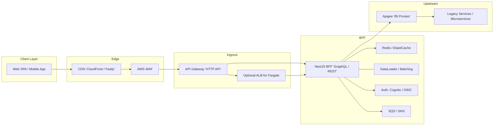

# BFF over 85 Apigee Proxies — Blueprint Architecture

> A production-ready blueprint to build a Backend-for-Frontend (BFF) that aggregates, orchestrates and secures 85 Apigee proxies. Includes component diagram, data flows, scalability patterns, and a recommended tech stack and folder layout.

---

## High-level goals

- Provide a single client-facing API (REST or GraphQL) tailored to each client (web, mobile) that aggregates many Apigee-backed services.
- Reduce chattiness and number of client calls.
- Apply auth, caching, batching, throttling, observability and resilience at the BFF layer.
- Deploy with minimal cold-start and operational overhead.

---

## System components (summary)

1. **Clients**: Web SPA, Mobile apps (iOS/Android), Internal Admin UI
2. **Edge & CDN**: CloudFront / Fastly — cache static assets and cache some public API responses
3. **WAF & CDN Rules**: AWS WAF to block bad traffic, rate-limit abusive clients at edge
4. **API Gateway**: AWS HTTP API or Cloud API Gateway (front for Lambda or Fargate)
5. **BFF Layer**: NestJS (GraphQL Gateway or REST BFF) — deployed as Lambda (serverless) or Fargate (for long-running connections)
6. **Gateway Features inside BFF**:
   - Auth middleware (OIDC/JWT validation via Cognito/Auth0)
   - Schema (GraphQL) or REST controllers
   - Resolvers calling Apigee proxies
   - Batching (DataLoader), request coalescing
   - Caching (Redis/ElastiCache) and Edge caching hints
   - Circuit breakers, retries, rate limiting
   - Observability (OpenTelemetry + AWS X-Ray + CloudWatch)
7. **API Management**: Apigee proxies (existing 85) — BFF calls them as upstreams
8. **Shared infra**: Redis, RDS/NoSQL for written state, SQS for async jobs, Secrets Manager
9. **CI/CD**: GitHub Actions / GitLab CI + serverless/esbuild or CDK pipeline
10. **Monitoring & Tracing**: Prometheus / CloudWatch / Grafana / Jaeger

---

## Diagram (Mermaid)



---

## Data flow (step-by-step)

1. Client calls BFF endpoint (GraphQL/REST) via CDN + API Gateway (TLS terminated at edge).
2. API Gateway forwards to the NestJS BFF (AWS Lambda or Fargate). JWT/OIDC token validated in BFF.
3. BFF resolves request:
   - Check local/Redis cache for the needed payload.
   - If cache miss, use DataLoader/batching to group multiple calls to the same Apigee proxy.
   - Apply short-circuit circuit-breaker for flaky proxies (open after N failures).
   - Respect Apigee quotas: use a token-bucket rate limiter and backpressure.
4. BFF aggregates and transforms Apigee responses into the client shape.
5. BFF returns the result (with proper caching headers) to the CDN and client.
6. For async tasks, enqueue to SQS and respond quickly; workers consume SQS to call Apigee or downstream systems.

---

## Deployment options & trade-offs

- **Lambda (Serverless)**
  - Pros: low ops, auto-scaling, pay-per-use.
  - Cons: cold starts, may need provisioned concurrency for consistent latency.
  - Best when: variable traffic and you can optimize cold starts (Fastify adapter, small bootstrap).

- **Fargate / ECS**
  - Pros: predictable performance, long-running processes, simpler warm caches.
  - Cons: more infra to manage, cost at idle.
  - Best when: high sustained throughput or heavy in-memory caching.

- **Hybrid**
  - Use Lambdas for most API calls and Fargate for components that require in-memory caches or long life (e.g., subscriptions).

---

## Reliability & Resilience patterns

- **Circuit Breaker**: `opossum` or custom interceptor in NestJS
- **Retries**: exponential backoff, but respect idempotency
- **Bulkhead**: isolate heavy endpoints into separate functions/containers
- **Rate-limiting**: Token bucket per client key + shared Redis counters
- **Backpressure**: return 429 or degraded responses when Apigee shows slowness
- **Graceful degradation**: return last-known-good cached responses for non-critical endpoints

---

## Caching strategy

- **Edge CDN**: cache fully public responses (long TTL)
- **BFF-level (Redis)**: cached aggregated payloads and session caches (short TTLs, e.g., 30s–5m)
- **Apigee-level**: rely on Apigee response cache where possible; BFF should include cache-control hints
- **Cache keys**: include route + query + authorization scope if needed

---

## Security

- **Auth**: Validate JWT in BFF with user claims -> map to Apigee client credentials or propagate JWT
- **Secrets**: store Apigee keys in Secrets Manager / Parameter Store
- **Network**: use VPC egress and NAT if calling internal Apigee endpoints that require static IPs
- **WAF**: rate-limit & block malicious patterns
- **Audit logs**: capture request/response traces (PII redaction)

---

## Observability

- **Tracing**: OpenTelemetry + inject trace id across BFF -> Apigee (if Apigee supports) -> backend
- **Metrics**: request latency, error rates, cache hit ratio, Apigee latency per proxy
- **Logging**: structured logs (JSON), ship to CloudWatch / ELK
- **SLOs**: set latency/error SLOs per endpoint and per Apigee proxy

---

## Example tech stack & libraries

- **Runtime**: Node 20
- **Framework**: NestJS (Fastify adapter for performance)
- **GraphQL**: Apollo Server (or `@nestjs/graphql`) + DataLoader
- **HTTP client**: `axios` or `undici` with keep-alive and connection pooling
- **Caching**: Redis (ElastiCache)
- **Queue**: SQS + worker (BullMQ if you want Redis-based)
- **Resilience**: `opossum` (circuit breaker) or custom interceptor
- **Validation**: `zod` or `class-validator`
- **Tracing**: OpenTelemetry + AWS X-Ray integration
- **Infra**: Serverless Framework (serverless-esbuild) or AWS CDK
- **CI/CD**: GitHub Actions

---

## Folder layout (suggested)

```
/bff
  /src
    /modules
      /users
        users.module.ts
        users.resolver.ts
        users.service.ts
    /apigee
      apigee.client.ts
      apigee.adapters.ts
    /common
      /interceptors
      /guards
      /dataloaders
    lambda.ts
    main.ts
  serverless.yml
  esbuild.config.js
```

---

## Example Lambda bootstrap (short)

```ts
// lambda.ts
import { Handler } from 'aws-lambda';
import serverless from 'serverless-http';
import { NestFactory } from '@nestjs/core';
import { AppModule } from './app.module';

let handler: Handler;

async function bootstrap() {
  const app = await NestFactory.create(AppModule, { logger: false });
  await app.init();
  return serverless(app.getHttpAdapter().getInstance());
}

export const main: Handler = async (event, context) => {
  if (!handler) handler = await bootstrap();
  return handler(event, context);
};
```

---

## Operational checklist before production

- Load test the BFF hitting representative Apigee proxies (not just the happy path).
- Establish SLOs and alerting (latency p95, error rate).
- Run chaos tests: simulate Apigee failures and validate circuit breaker behavior.
- Secure secrets and rotate Apigee keys.
- Implement rate-limiting and quota enforcement per client.
- Document the mapping from client API endpoints to Apigee proxies (traceability matrix for the 85 proxies).

---

## Next steps I can do for you

- Produce a **detailed deployment template** (Serverless + esbuild) tuned for NestJS + Fastify.
- Generate a **mapping matrix** showing how 85 Apigee proxies map to BFF endpoints (CSV or table) — if you provide the list.
- Create a **sample resolver** that batches 20 calls to different Apigee proxies.


---

*End of blueprint.*
